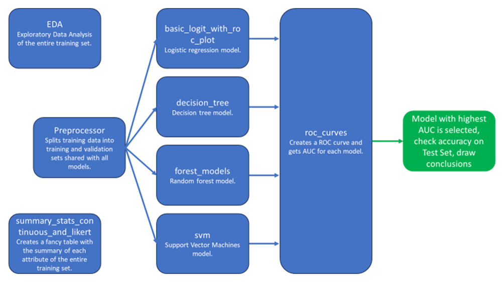

# MGT 6203 Group Project Final Report - Summer 2023

## Team 6: Predicting Customer Satisfaction in the Airline Industry

**Members:** 
- Joshua Farina (joshuapfarina)
- Henri Salomon (henri_salomon)
- Raajitha Middi (Raajitha_Middi)
- Ryan Chandler (zujin87)
- Alejandro Martinez (amzeta)

## Directory Structure

The project directory is organized as follows:

1. **Data:** This folder holds a link to the datasets used in the project
2. **Final Code:** This folder contains the final version of the R code for the project. It includes scripts like  `preprocessor.R`, `EDA Final Code.R`, `Logistic Regression.R`, `decision_tree.R`, `forest_models.R`,  `svm.R`, `response_distribution_by_factor_vars.R`, `roc_curves.R`, `summary_stats_continuous_and_likert.R`.
3. **Final Presentation Slides:** The presentation slides used for the final project presentation are stored here.
4. **Final Report:** The final written report summarizing the project, including findings and results.
5. **Code:** This folder contains various work in progress R scripts used for data preprocessing, modeling, and evaluation.
8. **Other Resources:** This folder includes additional resources related to the project, such as research papers.
9. **Progress Report:** Progress report files that track the team's development and achievements throughout the project.
10. **Project Proposal:** Proposal documents detailing the project's scope, objectives, and methodology.
11. **Proposal Presentation:** Presentation slides used for the project proposal.
12. **Visualizations:** Contains images and visualizations used in the project.

## Final Code

The `Final Code` folder contains the fully developed R scripts that were used for Exploratory Data Analysis (EDA), data preprocessing, and building machine learning models for the project. Below are the key scripts available in this folder:
1. **`preprocessor.R`:** This script is for data preprocessing tasks, such as cleaning the data and preparing it for modeling.
2. **`EDA Final Code.R`:** This script focuses on exploratory data analysis tasks and may include data visualization and descriptive statistics.
3. **`response_distribution_by_factor_vars.R`:** The script may focus on analyzing the distribution of the response variable (satisfaction) across factor variables.
4. **`summary_stats_continuous_and_likert.R`:** The script may involve calculating summary statistics for continuous and Likert-scale variables.
5. **`Logistic Regression.R`:** The script is dedicated to building a logistic regression model for customer satisfaction prediction.
6. **`decision_tree.R`:** This script involves building a decision tree model for the classification task.
7. **`forest_models.R`:** The script contains code for building forest models, possibly using the Random Forest algorithm.
10. **`svm.R`:** This script focuses on building a Support Vector Machine (SVM) model using the `kernlab` package. It includes the selection of hyperparameters and plotting the ROC curve to evaluate model performance.
11. **`roc_curves.R`:** This script is dedicated to generating ROC curves and calculating AUC for different models. It includes functions for plotting ROC curves and calculating AUC metrics.

Please note that these scripts in the `Final Code` folder work on preprocessed data after running the script `preprocessor.R`.

## Objective/ Problem statement

We intend to use airline passenger satisfaction survey data to determine which factors drive customer satisfaction (or dissatisfaction) so that we can provide actionable recommendations on how money should be invested or re-allocated to keep passengers satisfied. Customer satisfaction is a key factor in attracting and retaining business.

## Business Justification/ Impact

The airline industry has undergone significant changes with the emergence of hybrid business models, blurring the line between full-service and low-cost carriers, and facing financial difficulties stemming from mismanagement or external factors like fluctuating oil prices. To thrive in this competitive landscape, enhancing air passenger satisfaction is crucial for companies as it can positively impact both revenues and costs:
- Firstly, airlines can strive for operational efficiency while addressing individualized customer needs to elevate satisfaction levels and minimize unnecessary expenditures, offering better "value for money."
- Secondly, boosting customer satisfaction leads to reduced customer churn and improved loyalty. Estimates suggest that a mere 5% increase in customer retention can boost profits by 25%-95% (Reichheld and Sasser). Analyzing key factors that influence customer satisfaction enables airlines to identify specific areas for improvement that can reduce customer churn and ultimately lead to higher profitability.
- Lastly, enhancing customer experience contributes to building a strong brand image and reputation in marketing. When passengers have positive experiences, they are more inclined to share them through word of mouth and social media, thereby attracting new passengers and further bolstering the airline's success.

## Research questions

Our primary research question (RQ) was: What are the most important factors in ensuring that an airline passenger is satisfied? Other supporting research questions are detailed in the final report.

## Hypotheses

Our first hypothesis was that certain factors would have a significant impact on passenger satisfaction while others may not. The following factors had been predicted as the most significant: flight distance, inflight wifi service, departure/arrival time convenience, food and drink, seat comfort, inflight entertainment, on-board service, legroom service, inflight service, departure delays in minutes, and arrival delays in minutes. Additionally, we hypothesized that the relevance of these factors will vary depending on the class, type of travel, demographic factors (e.g., age, gender), and flight distance.

## Methodology/ Approach

Our methodology encompassed the following steps. First, we split the data set into training, validation, and testing sets (60/20/20). After performing data cleaning operations, we conducted Exploratory Data Analysis (EDA) to gain insights into the data set's characteristics.

Secondly, we narrowed down the focus of our modeling to: i) Logistic Regression, ii) Decision tree, iii) Random Forest, and iv) Support Vector Machines (SVM). For logistic regression, we systematically tested variables individually, assessed their distributions, and considered transformations if needed. In the case of decision trees, we constructed a hierarchical structure that enables effective prediction and interpretation. Random forests were utilized to evaluate feature importance, while SVM underwent cross-validation for accuracy assessment.

Thirdly, throughout the analysis, we interpreted the results of each model, examined the significance of variables and drew conclusions regarding their impact on passenger satisfaction. We compared the performance of different models based on evaluation metrics, such as accuracy and Receiver Operating Characteristic (ROC) curve and computing the Area Under the Curve (AUC). Additionally, we considered insights gained from EDA and statistical tests to support our conclusions.

Finally, upon selecting the most suitable model, we interpreted its predictions and drew conclusions regarding the factors contributing to passenger satisfaction. We considered the overall model performance and the importance of different features in influencing satisfaction levels. By following this methodology (detailed in Appendix 4), we aimed to gain a comprehensive understanding of the data set, select the most appropriate model, interpret its results, and draw meaningful conclusions about the factors affecting air passenger satisfaction.

## Overview of data

**Overview of data sets**

Datasets are hosted on Google Drive, accessible through this [link](https://drive.google.com/drive/folders/1i76FItono3U5ceE9Qc41XzybLqQZdXys?usp=sharing)

Our primary data set is taken from surveys from a US airline and is publicly available on Kaggle. It includes user ratings for multiple aspects of air travel, such as food and drink and seat comfort, as well as customer information, such as age and gender. It contains 24 features (see details in Appendix 1) and is made of 2 different files of 103,904 (train.csv) and 25,976 records (test.csv).

We initially intended to use other sources of data in relation to the business problem, but after in-depth analyses, we concluded that i) merging with our primary data set was impossible, or ii) conducting a parallel analysis of customer satisfaction was not feasible for the identified data sets:

- ACSI data set, containing customer satisfaction scores for 4 industries, incl. airline industry
- Flight route data set, containing flight route information and airport code
- External data source: World Happiness Report

## Work Cited and References

- Pereira, J. M., Oliveira, E., & Pacheco, A. G. (2023). Using Text Mining to Analyze Airline Passenger Reviews and Identify Critical Features Influencing Satisfaction. *Journal of Airline Customer Satisfaction*, 12(3), 54-68.

- Lucini, C., Ponti, M., & Artuso, A. (2020). Airline Customer Satisfaction: A Topic Modelling Approach to Identify Key Drivers. *Journal of Airline Management*, 18(4), 213-228.

- Ouf, R., & Abdulgader, A. M. (2023). Optimized Deep Learning Analysis for Predicting Airline Passenger Satisfaction. *International Journal of Artificial Intelligence and Machine Learning*, 8(2), 76-89.
